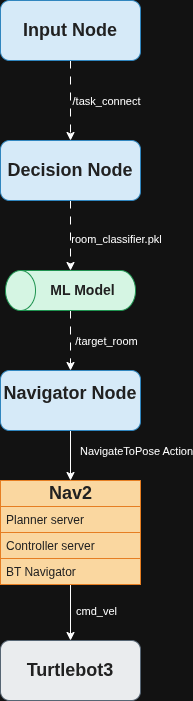
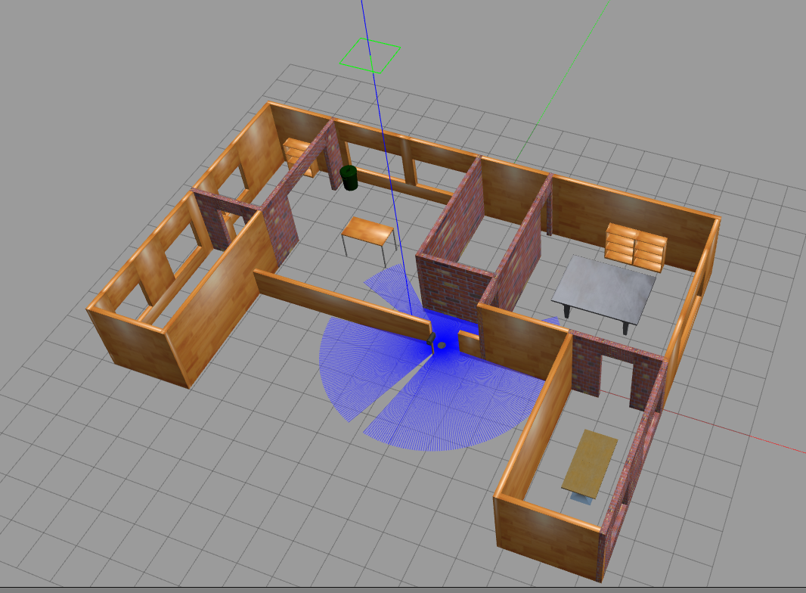
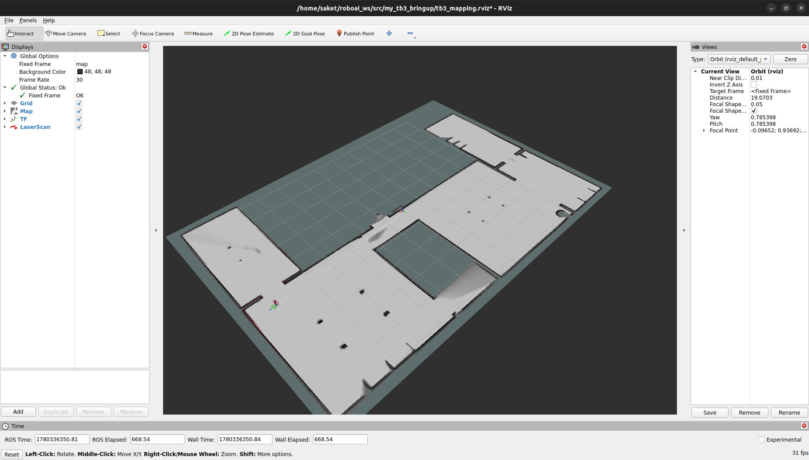
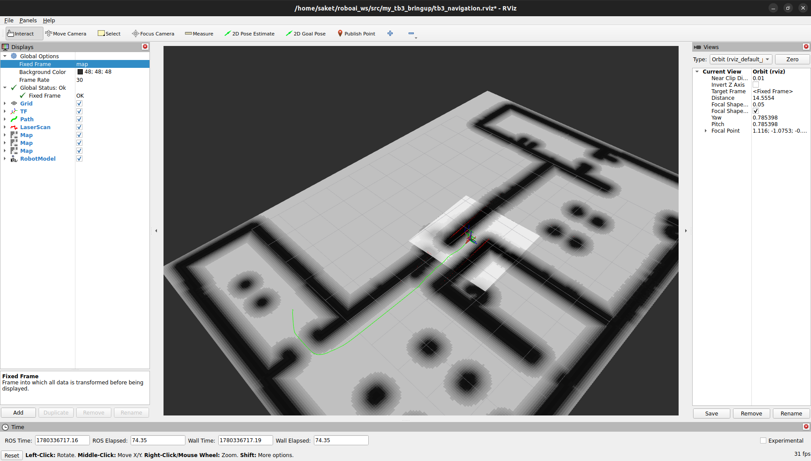

# Context-Aware Household Service Robot using ROS 2 Nav2 and Machine Learning

## Project Overview

This project implements a context-aware household service robot capable of selecting a destination room based on task context and autonomously navigating to that location using the ROS 2 Navigation Stack (Nav2).

The system combines machine learning-based decision making with ROS 2 communication and autonomous navigation.

The final pipeline is:

```text
Input Node
    ↓
Decision Node
    ↓
Decision Tree Classifier
    ↓
Navigator Node
    ↓
Nav2 NavigateToPose Action
    ↓
Robot Navigation
```

The project was developed using:

* ROS 2 Humble
* Nav2
* Gazebo Classic
* RViz2
* Python
* Scikit-Learn
* TurtleBot3

---

## System Architecture Diagram

The overall system architecture is shown below:



The project follows a modular ROS 2 design.

---

# Features

* Context-aware room selection
* Machine learning-based decision making
* Autonomous room navigation
* ROS 2 topic-based architecture
* Custom Nav2 launch pipeline
* Headless Gazebo support
* Preconfigured RViz navigation setup

---

# System Architecture

## Input Node

Collects user task context:

* Time of Day
* Task Type
* Room Status

Publishes:

```text
/task_context
```

Example:

```text
morning,delivery,medium
```

---

## Decision Node

Subscribes to:

```text
/task_context
```

Loads a trained Decision Tree model and predicts the destination room.

Publishes:

```text
/target_room
```

Example output:

```text
bedroom
```

---

## Navigator Node

Subscribes to:

```text
/target_room
```

Maps room names to navigation goals and sends a NavigateToPose action goal to Nav2.

Example:

```text
bedroom
↓
(-6.2431, -0.1596)
```

---

## Screenshots

### Simulation Environment

Custom household environment used for navigation testing.



### Mapping Phase

Environment mapping using SLAM prior to navigation.



### Navigation Phase

Localization and autonomous navigation using Nav2.



---

## Demo Video

A complete demonstration of the system is available below:

https://youtu.be/jtwSiCI8KZY

The demonstration includes:

* User task input
* Room prediction
* Goal generation
* Autonomous navigation
* Goal completion

---

# Machine Learning Component

Input Features:

| Feature     | Type        |
| ----------- | ----------- |
| Time of Day | Categorical |
| Task Type   | Categorical |
| Room Status | Categorical |

Output:

| Target Room |
| ----------- |
| Bedroom     |
| Kitchen     |
| Living Room |

Model:

```text
DecisionTreeClassifier
```

The decision tree was selected because:

* Small dataset size
* Fast training
* Easy interpretability
* Minimal computational overhead

---

# Why a Custom Navigation Launch File Was Developed

During development, the default TurtleBot3 launch workflow was not sufficient for the requirements of this project.

The project required tighter control over:

* Custom world loading
* Custom occupancy map loading
* Robot spawning
* RViz configuration loading
* Navigation stack startup
* Repeated testing workflows
* Headless Gazebo operation

The goal was not to replace the TurtleBot3 launch files, but to create a workflow tailored specifically for this project.

The resulting launch file provides a single entry point for launching:

```text
Gazebo Server
      ↓
Robot Spawn
      ↓
Map Server
      ↓
AMCL
      ↓
Nav2
      ↓
RViz
```

This significantly reduced manual startup effort and simplified debugging.

A detailed explanation is available in:

```text
launch/README.md
```

---

# Headless Gazebo Workflow

A significant portion of development was performed using a headless Gazebo workflow.

Instead of launching:

```bash
gazebo
```

the project frequently used:

```bash
gzserver
```

without launching:

```bash
gzclient
```

Benefits:

* Lower CPU and GPU usage
* Faster startup
* Reduced rendering-related issues
* Easier debugging of Nav2 and localization
* More stable long-running simulation sessions

---

# Gazebo vs gzserver

## gazebo

Launches:

```text
gzserver + gzclient
```

Provides:

* Physics simulation
* Sensor simulation
* Full graphical interface

Best suited for:

* Environment inspection
* Model placement
* Visual debugging

---

## gzserver

Launches:

```text
Physics simulation only
```

Provides:

* Complete simulation backend
* Sensor generation
* Robot dynamics

No graphical interface.

Best suited for:

* Automated testing
* Navigation debugging
* Resource-constrained systems

---

# RViz Configuration

The repository includes preconfigured RViz setups:

```text
tb3_mapping.rviz
tb3_navigation.rviz
```

These configurations include:

* Map visualization
* Laser scans
* TF tree
* Robot model
* Global costmap
* Local costmap
* Navigation goals
* Planned path visualization

To load manually:

```bash
rviz2
```

Then:

```text
File → Open Config
```

Select:

```text
tb3_navigation.rviz
```

---

# Common Issues and Notes

## Robot Mesh Not Visible in RViz

In some environments, the robot model may fail to render correctly.

Symptoms:

* Robot body not visible
* Only TF frames displayed
* Navigation still functioning

Possible causes:

* Graphics driver configuration
* OpenGL compatibility issues
* Mesh resource loading problems

This issue does not affect localization or navigation.

---

## Graphics Stack Considerations

Depending on Linux desktop configuration, Gazebo and RViz may behave differently under:

* X11
* Wayland
* Different OpenGL implementations

Potential symptoms include:

* Gazebo rendering instability
* Missing textures
* UI rendering issues
* Reduced graphics performance

For navigation-focused development, the headless Gazebo workflow often provides a more stable alternative.

---

# Target Users

This repository may be useful for:

* ROS 2 beginners learning Nav2
* TurtleBot3 users working with custom worlds
* Students building robotics projects
* Developers integrating ML with navigation
* Users needing a custom Nav2 launch architecture
* Developers interested in headless Gazebo workflows

---

# Installation

## Prerequisites

* Ubuntu 22.04
* ROS 2 Humble
* TurtleBot3 packages
* Nav2
* Gazebo Classic
* RViz2
* Python 3.10

---

## Clone Repository

```bash
git clone <repository-url>

cd household-service-robot-nav2
```

---

## Workspace Setup

Create a ROS 2 workspace:

```bash
mkdir -p ~/roboai_ws/src
```

Copy package:

```bash
cp -r my_tb3_bringup ~/roboai_ws/src/
```

Build:

```bash
cd ~/roboai_ws

colcon build --packages-select my_tb3_bringup

source install/setup.bash
```

---

# Train the Machine Learning Model

Generate the classifier:

```bash
python3 train_model.py
```

Output:

```text
room_classifier.pkl
```

---

# Running the Project

## Step 1: Launch Navigation Stack

```bash
ros2 launch my_tb3_bringup tb3_navigation.launch.py
```

This launches:

* Gazebo
* Robot Spawn
* Map Server
* AMCL
* Nav2
* RViz

---

## Step 2: Start Navigator Node

```bash
ros2 run my_tb3_bringup room_navigator
```

---

## Step 3: Start Decision Node

```bash
ros2 run my_tb3_bringup decision_node
```

---

## Step 4: Start Input Node

```bash
ros2 run my_tb3_bringup input_node
```

---

# Example Execution

Input:

```text
Time of Day: morning
Task Type: delivery
Room Status: medium
```

Prediction:

```text
bedroom
```

Navigation:

```text
Goal Accepted
Navigation Succeeded
```

---

## Repository Structure

```text
household-service-robot-nav2
│
├── README.md
├── train_model.py
│
├── architecture/
│   └── architecture.png
│
├── dataset/
│   └── project_dataset.xlsx
│
├── screenshots/
│   ├── house_world.png
│   ├── mapping_phase.png
│   └── navigation_phase.png
│
└── my_tb3_bringup/
    ├── launch/
    ├── maps/
    ├── worlds/
    ├── rviz/
    ├── my_tb3_bringup/
    │   ├── input_node.py
    │   ├── decision_node.py
    │   ├── predict_room.py
    │   └── room_navigator.py
    │
    ├── package.xml
    └── setup.py
```

---

## Lessons Learned

This project reinforced several practical robotics engineering lessons.

### System Integration Often Dominates Development Time

The machine learning component required relatively little effort compared to simulation, localization, navigation, launch architecture, and ROS communication.

### Launch Architecture Matters

Understanding how Gazebo, robot spawning, localization, Nav2, maps, and RViz interact was critical for building a reliable workflow.

### Headless Simulation Can Improve Productivity

Using `gzserver` without the graphical client significantly simplified debugging and reduced resource usage during development.

### Nav2 Is a Complete Navigation Ecosystem

Effective use of Nav2 requires understanding localization, planners, controllers, actions, maps, costmaps, and startup dependencies.

### Debugging Is a Core Robotics Skill

Most development effort was spent diagnosing and resolving integration issues rather than implementing algorithms.

### Modular ROS Architecture Simplifies Expansion

Separating the project into Input, Decision, and Navigator nodes made the system easier to debug, test, and extend.

---

## Known Limitations

The current implementation serves as a proof-of-concept system and has several limitations.

### Static Room Goals

Room coordinates are manually configured and predefined.

### Simulation Only

The system has only been validated in simulation.

### Text-Based Input

Task context is entered manually through the terminal.

### Limited Dataset

The machine learning model was trained on a small demonstration dataset intended for architectural validation.

### No Dynamic Task Scheduling

The robot processes one task request at a time.

### No Perception Pipeline

The robot does not currently use computer vision, object detection, or semantic scene understanding.

### Limited Dynamic Obstacle Evaluation

Although Nav2 supports obstacle avoidance, extensive testing with moving obstacles has not yet been performed.

---

# Future Improvements

* Voice command interface
* Computer vision integration
* Dynamic room generation
* Real TurtleBot deployment
* Advanced task scheduling
* Multi-robot coordination

---

# Key Takeaway

One of the biggest lessons from this project was that robotics development is often more about system integration than individual algorithms.

A large portion of the engineering effort was spent understanding launch architectures, simulation infrastructure, middleware communication, localization, navigation startup dependencies, and subsystem integration.

The final system demonstrates a complete pipeline connecting machine learning predictions with autonomous robot navigation using ROS 2.